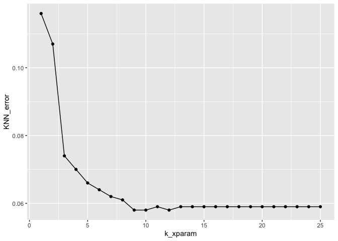

## R Markdown

This is an R Markdown document. Markdown is a simple formatting syntax for authoring HTML, PDF, and MS Word documents. For more details on using R Markdown see <http://rmarkdown.rstudio.com>.

When you click the **Knit** button a document will be generated that includes both content as well as the output of any embedded R code chunks within the document. You can embed an R code chunk like this:


```r
summary(cars)
```

```
##      speed           dist       
##  Min.   : 4.0   Min.   :  2.00  
##  1st Qu.:12.0   1st Qu.: 26.00  
##  Median :15.0   Median : 36.00  
##  Mean   :15.4   Mean   : 42.98  
##  3rd Qu.:19.0   3rd Qu.: 56.00  
##  Max.   :25.0   Max.   :120.00
```

## Including Plots

You can also embed plots, for example:

<!-- -->

Note that the `echo = FALSE` parameter was added to the code chunk to prevent printing of the R code that generated the plot.


```r
library(ISLR)
head(Caravan)
```

```
##   MOSTYPE MAANTHUI MGEMOMV MGEMLEEF MOSHOOFD MGODRK MGODPR MGODOV MGODGE MRELGE
## 1      33        1       3        2        8      0      5      1      3      7
## 2      37        1       2        2        8      1      4      1      4      6
## 3      37        1       2        2        8      0      4      2      4      3
## 4       9        1       3        3        3      2      3      2      4      5
## 5      40        1       4        2       10      1      4      1      4      7
## 6      23        1       2        1        5      0      5      0      5      0
##   MRELSA MRELOV MFALLEEN MFGEKIND MFWEKIND MOPLHOOG MOPLMIDD MOPLLAAG MBERHOOG
## 1      0      2        1        2        6        1        2        7        1
## 2      2      2        0        4        5        0        5        4        0
## 3      2      4        4        4        2        0        5        4        0
## 4      2      2        2        3        4        3        4        2        4
## 5      1      2        2        4        4        5        4        0        0
## 6      6      3        3        5        2        0        5        4        2
##   MBERZELF MBERBOER MBERMIDD MBERARBG MBERARBO MSKA MSKB1 MSKB2 MSKC MSKD
## 1        0        1        2        5        2    1     1     2    6    1
## 2        0        0        5        0        4    0     2     3    5    0
## 3        0        0        7        0        2    0     5     0    4    0
## 4        0        0        3        1        2    3     2     1    4    0
## 5        5        4        0        0        0    9     0     0    0    0
## 6        0        0        4        2        2    2     2     2    4    2
##   MHHUUR MHKOOP MAUT1 MAUT2 MAUT0 MZFONDS MZPART MINKM30 MINK3045 MINK4575
## 1      1      8     8     0     1       8      1       0        4        5
## 2      2      7     7     1     2       6      3       2        0        5
## 3      7      2     7     0     2       9      0       4        5        0
## 4      5      4     9     0     0       7      2       1        5        3
## 5      4      5     6     2     1       5      4       0        0        9
## 6      9      0     5     3     3       9      0       5        2        3
##   MINK7512 MINK123M MINKGEM MKOOPKLA PWAPART PWABEDR PWALAND PPERSAUT PBESAUT
## 1        0        0       4        3       0       0       0        6       0
## 2        2        0       5        4       2       0       0        0       0
## 3        0        0       3        4       2       0       0        6       0
## 4        0        0       4        4       0       0       0        6       0
## 5        0        0       6        3       0       0       0        0       0
## 6        0        0       3        3       0       0       0        6       0
##   PMOTSCO PVRAAUT PAANHANG PTRACTOR PWERKT PBROM PLEVEN PPERSONG PGEZONG
## 1       0       0        0        0      0     0      0        0       0
## 2       0       0        0        0      0     0      0        0       0
## 3       0       0        0        0      0     0      0        0       0
## 4       0       0        0        0      0     0      0        0       0
## 5       0       0        0        0      0     0      0        0       0
## 6       0       0        0        0      0     0      0        0       0
##   PWAOREG PBRAND PZEILPL PPLEZIER PFIETS PINBOED PBYSTAND AWAPART AWABEDR
## 1       0      5       0        0      0       0        0       0       0
## 2       0      2       0        0      0       0        0       2       0
## 3       0      2       0        0      0       0        0       1       0
## 4       0      2       0        0      0       0        0       0       0
## 5       0      6       0        0      0       0        0       0       0
## 6       0      0       0        0      0       0        0       0       0
##   AWALAND APERSAUT ABESAUT AMOTSCO AVRAAUT AAANHANG ATRACTOR AWERKT ABROM
## 1       0        1       0       0       0        0        0      0     0
## 2       0        0       0       0       0        0        0      0     0
## 3       0        1       0       0       0        0        0      0     0
## 4       0        1       0       0       0        0        0      0     0
## 5       0        0       0       0       0        0        0      0     0
## 6       0        1       0       0       0        0        0      0     0
##   ALEVEN APERSONG AGEZONG AWAOREG ABRAND AZEILPL APLEZIER AFIETS AINBOED
## 1      0        0       0       0      1       0        0      0       0
## 2      0        0       0       0      1       0        0      0       0
## 3      0        0       0       0      1       0        0      0       0
## 4      0        0       0       0      1       0        0      0       0
## 5      0        0       0       0      1       0        0      0       0
## 6      0        0       0       0      0       0        0      0       0
##   ABYSTAND Purchase
## 1        0       No
## 2        0       No
## 3        0       No
## 4        0       No
## 5        0       No
## 6        0       No
```

```r
str(Caravan)
```

```
## 'data.frame':	5822 obs. of  86 variables:
##  $ MOSTYPE : num  33 37 37 9 40 23 39 33 33 11 ...
##  $ MAANTHUI: num  1 1 1 1 1 1 2 1 1 2 ...
##  $ MGEMOMV : num  3 2 2 3 4 2 3 2 2 3 ...
##  $ MGEMLEEF: num  2 2 2 3 2 1 2 3 4 3 ...
##  $ MOSHOOFD: num  8 8 8 3 10 5 9 8 8 3 ...
##  $ MGODRK  : num  0 1 0 2 1 0 2 0 0 3 ...
##  $ MGODPR  : num  5 4 4 3 4 5 2 7 1 5 ...
##  $ MGODOV  : num  1 1 2 2 1 0 0 0 3 0 ...
##  $ MGODGE  : num  3 4 4 4 4 5 5 2 6 2 ...
##  $ MRELGE  : num  7 6 3 5 7 0 7 7 6 7 ...
##  $ MRELSA  : num  0 2 2 2 1 6 2 2 0 0 ...
##  $ MRELOV  : num  2 2 4 2 2 3 0 0 3 2 ...
##  $ MFALLEEN: num  1 0 4 2 2 3 0 0 3 2 ...
##  $ MFGEKIND: num  2 4 4 3 4 5 3 5 3 2 ...
##  $ MFWEKIND: num  6 5 2 4 4 2 6 4 3 6 ...
##  $ MOPLHOOG: num  1 0 0 3 5 0 0 0 0 0 ...
##  $ MOPLMIDD: num  2 5 5 4 4 5 4 3 1 4 ...
##  $ MOPLLAAG: num  7 4 4 2 0 4 5 6 8 5 ...
##  $ MBERHOOG: num  1 0 0 4 0 2 0 2 1 2 ...
##  $ MBERZELF: num  0 0 0 0 5 0 0 0 1 0 ...
##  $ MBERBOER: num  1 0 0 0 4 0 0 0 0 0 ...
##  $ MBERMIDD: num  2 5 7 3 0 4 4 2 1 3 ...
##  $ MBERARBG: num  5 0 0 1 0 2 1 5 8 3 ...
##  $ MBERARBO: num  2 4 2 2 0 2 5 2 1 3 ...
##  $ MSKA    : num  1 0 0 3 9 2 0 2 1 1 ...
##  $ MSKB1   : num  1 2 5 2 0 2 1 1 1 2 ...
##  $ MSKB2   : num  2 3 0 1 0 2 4 2 0 1 ...
##  $ MSKC    : num  6 5 4 4 0 4 5 5 8 4 ...
##  $ MSKD    : num  1 0 0 0 0 2 0 2 1 2 ...
##  $ MHHUUR  : num  1 2 7 5 4 9 6 0 9 0 ...
##  $ MHKOOP  : num  8 7 2 4 5 0 3 9 0 9 ...
##  $ MAUT1   : num  8 7 7 9 6 5 8 4 5 6 ...
##  $ MAUT2   : num  0 1 0 0 2 3 0 4 2 1 ...
##  $ MAUT0   : num  1 2 2 0 1 3 1 2 3 2 ...
##  $ MZFONDS : num  8 6 9 7 5 9 9 6 7 6 ...
##  $ MZPART  : num  1 3 0 2 4 0 0 3 2 3 ...
##  $ MINKM30 : num  0 2 4 1 0 5 4 2 7 2 ...
##  $ MINK3045: num  4 0 5 5 0 2 3 5 2 3 ...
##  $ MINK4575: num  5 5 0 3 9 3 3 3 1 3 ...
##  $ MINK7512: num  0 2 0 0 0 0 0 0 0 1 ...
##  $ MINK123M: num  0 0 0 0 0 0 0 0 0 0 ...
##  $ MINKGEM : num  4 5 3 4 6 3 3 3 2 4 ...
##  $ MKOOPKLA: num  3 4 4 4 3 3 5 3 3 7 ...
##  $ PWAPART : num  0 2 2 0 0 0 0 0 0 2 ...
##  $ PWABEDR : num  0 0 0 0 0 0 0 0 0 0 ...
##  $ PWALAND : num  0 0 0 0 0 0 0 0 0 0 ...
##  $ PPERSAUT: num  6 0 6 6 0 6 6 0 5 0 ...
##  $ PBESAUT : num  0 0 0 0 0 0 0 0 0 0 ...
##  $ PMOTSCO : num  0 0 0 0 0 0 0 0 0 0 ...
##  $ PVRAAUT : num  0 0 0 0 0 0 0 0 0 0 ...
##  $ PAANHANG: num  0 0 0 0 0 0 0 0 0 0 ...
##  $ PTRACTOR: num  0 0 0 0 0 0 0 0 0 0 ...
##  $ PWERKT  : num  0 0 0 0 0 0 0 0 0 0 ...
##  $ PBROM   : num  0 0 0 0 0 0 0 3 0 0 ...
##  $ PLEVEN  : num  0 0 0 0 0 0 0 0 0 0 ...
##  $ PPERSONG: num  0 0 0 0 0 0 0 0 0 0 ...
##  $ PGEZONG : num  0 0 0 0 0 0 0 0 0 0 ...
##  $ PWAOREG : num  0 0 0 0 0 0 0 0 0 0 ...
##  $ PBRAND  : num  5 2 2 2 6 0 0 0 0 3 ...
##  $ PZEILPL : num  0 0 0 0 0 0 0 0 0 0 ...
##  $ PPLEZIER: num  0 0 0 0 0 0 0 0 0 0 ...
##  $ PFIETS  : num  0 0 0 0 0 0 0 0 0 0 ...
##  $ PINBOED : num  0 0 0 0 0 0 0 0 0 0 ...
##  $ PBYSTAND: num  0 0 0 0 0 0 0 0 0 0 ...
##  $ AWAPART : num  0 2 1 0 0 0 0 0 0 1 ...
##  $ AWABEDR : num  0 0 0 0 0 0 0 0 0 0 ...
##  $ AWALAND : num  0 0 0 0 0 0 0 0 0 0 ...
##  $ APERSAUT: num  1 0 1 1 0 1 1 0 1 0 ...
##  $ ABESAUT : num  0 0 0 0 0 0 0 0 0 0 ...
##  $ AMOTSCO : num  0 0 0 0 0 0 0 0 0 0 ...
##  $ AVRAAUT : num  0 0 0 0 0 0 0 0 0 0 ...
##  $ AAANHANG: num  0 0 0 0 0 0 0 0 0 0 ...
##  $ ATRACTOR: num  0 0 0 0 0 0 0 0 0 0 ...
##  $ AWERKT  : num  0 0 0 0 0 0 0 0 0 0 ...
##  $ ABROM   : num  0 0 0 0 0 0 0 1 0 0 ...
##  $ ALEVEN  : num  0 0 0 0 0 0 0 0 0 0 ...
##  $ APERSONG: num  0 0 0 0 0 0 0 0 0 0 ...
##  $ AGEZONG : num  0 0 0 0 0 0 0 0 0 0 ...
##  $ AWAOREG : num  0 0 0 0 0 0 0 0 0 0 ...
##  $ ABRAND  : num  1 1 1 1 1 0 0 0 0 1 ...
##  $ AZEILPL : num  0 0 0 0 0 0 0 0 0 0 ...
##  $ APLEZIER: num  0 0 0 0 0 0 0 0 0 0 ...
##  $ AFIETS  : num  0 0 0 0 0 0 0 0 0 0 ...
##  $ AINBOED : num  0 0 0 0 0 0 0 0 0 0 ...
##  $ ABYSTAND: num  0 0 0 0 0 0 0 0 0 0 ...
##  $ Purchase: Factor w/ 2 levels "No","Yes": 1 1 1 1 1 1 1 1 1 1 ...
```

```r
summary(Caravan$Purchase)
```

```
##   No  Yes 
## 5474  348
```

```r
any(is.na(Caravan))
```

```
## [1] FALSE
```

```r
var(Caravan[,1])
```

```
## [1] 165.0378
```

```r
var(Caravan[,2])
```

```
## [1] 0.1647078
```

```r
#Need to use standardized variables for the KNN model, creating a dataset without the "Purchase" variable
scaled_caravan <- scale(Caravan[,-86])
head(scaled_caravan)
```

```
##       MOSTYPE   MAANTHUI    MGEMOMV    MGEMLEEF   MOSHOOFD     MGODRK
## 1  0.68084775 -0.2725565  0.4066617 -1.21685949  0.7793384 -0.6942510
## 2  0.99221162 -0.2725565 -0.8594262 -1.21685949  0.7793384  0.3025256
## 3  0.99221162 -0.2725565 -0.8594262 -1.21685949  0.7793384 -0.6942510
## 4 -1.18733547 -0.2725565  0.4066617  0.01075374 -0.9708962  1.2993023
## 5  1.22573452 -0.2725565  1.6727497 -1.21685949  1.4794323  0.3025256
## 6 -0.09756193 -0.2725565 -0.8594262 -2.44447272 -0.2708024 -0.6942510
##       MGODPR      MGODOV     MGODGE      MRELGE     MRELSA     MRELOV
## 1  0.2174254 -0.06870474 -0.1618019  0.42763309 -0.9147152 -0.1686070
## 2 -0.3653787 -0.06870474  0.4641188 -0.09606902  1.1558416 -0.1686070
## 3 -0.3653787  0.91409379  0.4641188 -1.66717535  1.1558416  0.9923984
## 4 -0.9481828  0.91409379  0.4641188 -0.61977113  1.1558416 -0.1686070
## 5 -0.3653787 -0.06870474  0.4641188  0.42763309  0.1205632 -0.1686070
## 6  0.2174254 -1.05150327  1.0900394 -3.23828168  5.2969552  0.4118957
##      MFALLEEN   MFGEKIND   MFWEKIND   MOPLHOOG   MOPLMIDD  MOPLLAAG    MBERHOOG
## 1 -0.49316828 -0.7594776  0.8476406 -0.2840537 -0.7672994  1.056303 -0.49771599
## 2 -1.04874601  0.4751109  0.3489579 -0.9002091  0.9362281 -0.249109 -1.05379016
## 3  1.17356491  0.4751109 -1.1470900 -0.9002091  0.9362281 -0.249109 -1.05379016
## 4  0.06240945 -0.1421834 -0.1497247  0.9482569  0.3683856 -1.119384  1.17050651
## 5  0.06240945  0.4751109 -0.1497247  2.1805675  0.3683856 -1.989658 -1.05379016
## 6  0.61798718  1.0924051 -1.1470900 -0.9002091  0.9362281 -0.249109  0.05835818
##     MBERZELF   MBERBOER    MBERMIDD   MBERARBG   MBERARBO       MSKA      MSKB1
## 1 -0.5134655  0.4519435 -0.48867535  1.6062403 -0.1810114 -0.3602967 -0.4560402
## 2 -0.5134655 -0.4941964  1.14204755 -1.2825312  1.0004331 -0.9407194  0.2954645
## 3 -0.5134655 -0.4941964  2.22919616 -1.2825312 -0.1810114 -0.9407194  2.5499783
## 4 -0.5134655 -0.4941964  0.05489895 -0.7047769 -0.1810114  0.8005486  0.2954645
## 5  5.9375404  3.2903633 -1.57582395 -1.2825312 -1.3624559  4.2830845 -1.2075448
## 6 -0.5134655 -0.4941964  0.59847325 -0.1270226 -0.1810114  0.2201259  0.2954645
##       MSKB2       MSKC        MSKD      MHHUUR      MHKOOP       MAUT1
## 1 -0.132417  1.1579679 -0.05166673 -1.04776437  1.04480336  1.26200191
## 2  0.521469  0.6413238 -0.81902318 -0.72406662  0.72116169  0.61800374
## 3 -1.440189  0.1246797 -0.81902318  0.89442215 -0.89704665  0.61800374
## 4 -0.786303  0.1246797 -0.81902318  0.24702664 -0.24976331  1.90600008
## 5 -1.440189 -1.9418969 -0.81902318 -0.07667111  0.07387835 -0.02599443
## 6 -0.132417  0.1246797  0.71568971  1.54181766 -1.54432999 -0.66999260
##        MAUT2       MAUT0    MZFONDS     MZPART    MINKM30   MINK3045   MINK4575
## 1 -1.0941870 -0.59977226  0.8707582 -0.8723778 -1.2337313  0.2464230  1.1768383
## 2 -0.2629818  0.02533947 -0.1400192  0.1367586 -0.2750042 -1.8782344  1.1768383
## 3 -1.0941870  0.02533947  1.3761469 -1.3769460  0.6837229  0.7775874 -1.4168748
## 4 -1.0941870 -1.22488399  0.3653695 -0.3678096 -0.7543677  0.7775874  0.1393531
## 5  0.5682234 -0.59977226 -0.6454080  0.6413268 -1.2337313 -1.8782344  3.2518088
## 6  1.3994286  0.65045120  1.3761469 -1.3769460  1.1630865 -0.8159057  0.1393531
##     MINK7512   MINK123M    MINKGEM   MKOOPKLA    PWAPART    PWABEDR    PWALAND
## 1 -0.6846389 -0.3674677  0.1635790 -0.6159702 -0.8045004 -0.1103469 -0.1432555
## 2  1.0353041 -0.3674677  0.9224293 -0.1177515  1.2818254 -0.1103469 -0.1432555
## 3 -0.6846389 -0.3674677 -0.5952712 -0.1177515  1.2818254 -0.1103469 -0.1432555
## 4 -0.6846389 -0.3674677  0.1635790 -0.1177515 -0.8045004 -0.1103469 -0.1432555
## 5 -0.6846389 -0.3674677  1.6812795 -0.6159702 -0.8045004 -0.1103469 -0.1432555
## 6 -0.6846389 -0.3674677 -0.5952712 -0.6159702 -0.8045004 -0.1103469 -0.1432555
##    PPERSAUT     PBESAUT    PMOTSCO     PVRAAUT    PAANHANG   PTRACTOR
## 1  1.037277 -0.09083565 -0.1954581 -0.03861003 -0.09850147 -0.1535128
## 2 -1.017047 -0.09083565 -0.1954581 -0.03861003 -0.09850147 -0.1535128
## 3  1.037277 -0.09083565 -0.1954581 -0.03861003 -0.09850147 -0.1535128
## 4  1.037277 -0.09083565 -0.1954581 -0.03861003 -0.09850147 -0.1535128
## 5 -1.017047 -0.09083565 -0.1954581 -0.03861003 -0.09850147 -0.1535128
## 6  1.037277 -0.09083565 -0.1954581 -0.03861003 -0.09850147 -0.1535128
##        PWERKT      PBROM     PLEVEN    PPERSONG     PGEZONG     PWAOREG
## 1 -0.05702754 -0.2644663 -0.2168784 -0.06566456 -0.07942413 -0.06270462
## 2 -0.05702754 -0.2644663 -0.2168784 -0.06566456 -0.07942413 -0.06270462
## 3 -0.05702754 -0.2644663 -0.2168784 -0.06566456 -0.07942413 -0.06270462
## 4 -0.05702754 -0.2644663 -0.2168784 -0.06566456 -0.07942413 -0.06270462
## 5 -0.05702754 -0.2644663 -0.2168784 -0.06566456 -0.07942413 -0.06270462
## 6 -0.05702754 -0.2644663 -0.2168784 -0.06566456 -0.07942413 -0.06270462
##        PBRAND     PZEILPL   PPLEZIER     PFIETS     PINBOED   PBYSTAND
## 1  1.68801918 -0.01975991 -0.0692012 -0.1609305 -0.07640984 -0.1163233
## 2  0.09167162 -0.01975991 -0.0692012 -0.1609305 -0.07640984 -0.1163233
## 3  0.09167162 -0.01975991 -0.0692012 -0.1609305 -0.07640984 -0.1163233
## 4  0.09167162 -0.01975991 -0.0692012 -0.1609305 -0.07640984 -0.1163233
## 5  2.22013503 -0.01975991 -0.0692012 -0.1609305 -0.07640984 -0.1163233
## 6 -0.97256008 -0.01975991 -0.0692012 -0.1609305 -0.07640984 -0.1163233
##      AWAPART    AWABEDR    AWALAND   APERSAUT     ABESAUT    AMOTSCO
## 1 -0.8179643 -0.1101261 -0.1450573  0.7239515 -0.08060189 -0.1792835
## 2  3.2418723 -0.1101261 -0.1450573 -0.9295776 -0.08060189 -0.1792835
## 3  1.2119540 -0.1101261 -0.1450573  0.7239515 -0.08060189 -0.1792835
## 4 -0.8179643 -0.1101261 -0.1450573  0.7239515 -0.08060189 -0.1792835
## 5 -0.8179643 -0.1101261 -0.1450573 -0.9295776 -0.08060189 -0.1792835
## 6 -0.8179643 -0.1101261 -0.1450573  0.7239515 -0.08060189 -0.1792835
##       AVRAAUT    AAANHANG   ATRACTOR     AWERKT      ABROM     ALEVEN
## 1 -0.03554514 -0.09969096 -0.1398328 -0.0497904 -0.2656327 -0.2028925
## 2 -0.03554514 -0.09969096 -0.1398328 -0.0497904 -0.2656327 -0.2028925
## 3 -0.03554514 -0.09969096 -0.1398328 -0.0497904 -0.2656327 -0.2028925
## 4 -0.03554514 -0.09969096 -0.1398328 -0.0497904 -0.2656327 -0.2028925
## 5 -0.03554514 -0.09969096 -0.1398328 -0.0497904 -0.2656327 -0.2028925
## 6 -0.03554514 -0.09969096 -0.1398328 -0.0497904 -0.2656327 -0.2028925
##      APERSONG     AGEZONG     AWAOREG    ABRAND     AZEILPL    APLEZIER
## 1 -0.07315883 -0.08104764 -0.05991487  0.764905 -0.02270383 -0.07364394
## 2 -0.07315883 -0.08104764 -0.05991487  0.764905 -0.02270383 -0.07364394
## 3 -0.07315883 -0.08104764 -0.05991487  0.764905 -0.02270383 -0.07364394
## 4 -0.07315883 -0.08104764 -0.05991487  0.764905 -0.02270383 -0.07364394
## 5 -0.07315883 -0.08104764 -0.05991487  0.764905 -0.02270383 -0.07364394
## 6 -0.07315883 -0.08104764 -0.05991487 -1.014271 -0.02270383 -0.07364394
##       AFIETS     AINBOED   ABYSTAND
## 1 -0.1506075 -0.08734022 -0.1188063
## 2 -0.1506075 -0.08734022 -0.1188063
## 3 -0.1506075 -0.08734022 -0.1188063
## 4 -0.1506075 -0.08734022 -0.1188063
## 5 -0.1506075 -0.08734022 -0.1188063
## 6 -0.1506075 -0.08734022 -0.1188063
```

```r
# Purchase variable set

PurchaseOutcome <- Caravan[,86]

# Divide into training and test sets
test_index <- 1:1000
test_caravan <- scaled_caravan[test_index,]
train_caravan <- scaled_caravan[-test_index,]

test_Purchase <- PurchaseOutcome[test_index]
train_Purchase <- PurchaseOutcome[-test_index]

# Perform KNN learning model on train data

library(class)
set.seed(101)
KNN_model <- knn(train_caravan,test_caravan,train_Purchase,k=1)

# Check out some values and get error rate

head(KNN_model,20)
```

```
##  [1] No  No  No  No  No  No  Yes No  Yes No  No  No  Yes No  No  No  No  Yes Yes
## [20] No 
## Levels: No Yes
```

```r
mean(KNN_model != test_Purchase)
```

```
## [1] 0.116
```

```r
# Now let's work on improving the model by finding ideal k nearest neighbors
KNN_model <- NULL
KNN_error <- NULL

for(i in 1:25){
  set.seed(101)
  KNN_model <- knn(train_caravan,test_caravan,train_Purchase,k=i)
  KNN_error[i] <- mean(KNN_model != test_Purchase)
}

print(KNN_error)
```

```
##  [1] 0.116 0.107 0.074 0.070 0.066 0.064 0.062 0.061 0.058 0.058 0.059 0.058
## [13] 0.059 0.059 0.059 0.059 0.059 0.059 0.059 0.059 0.059 0.059 0.059 0.059
## [25] 0.059
```

```r
# plot error rates for each i
library(ggplot2)

k_xparam <- 1:25
error_rates <- data.frame(k_xparam,KNN_error)
ggplot(error_rates,aes(k_xparam,KNN_error)) + geom_line() + geom_point()
```

<!-- -->

```r
#Choose ideal K nearest neighbors parameter

error_rates
```

```
##    k_xparam KNN_error
## 1         1     0.116
## 2         2     0.107
## 3         3     0.074
## 4         4     0.070
## 5         5     0.066
## 6         6     0.064
## 7         7     0.062
## 8         8     0.061
## 9         9     0.058
## 10       10     0.058
## 11       11     0.059
## 12       12     0.058
## 13       13     0.059
## 14       14     0.059
## 15       15     0.059
## 16       16     0.059
## 17       17     0.059
## 18       18     0.059
## 19       19     0.059
## 20       20     0.059
## 21       21     0.059
## 22       22     0.059
## 23       23     0.059
## 24       24     0.059
## 25       25     0.059
```

Clearly 9 K Nearest Neighbors is our ideal parameter value that reduces the error rate to only 5.8%.


```r
set.seed(101)
KNN_model <- knn(train_caravan,test_caravan,train_Purchase,k=9)
mean(KNN_model != test_Purchase)
```

```
## [1] 0.058
```
There you go, the model is all set, and I'll be back with more ML fun stuff.


